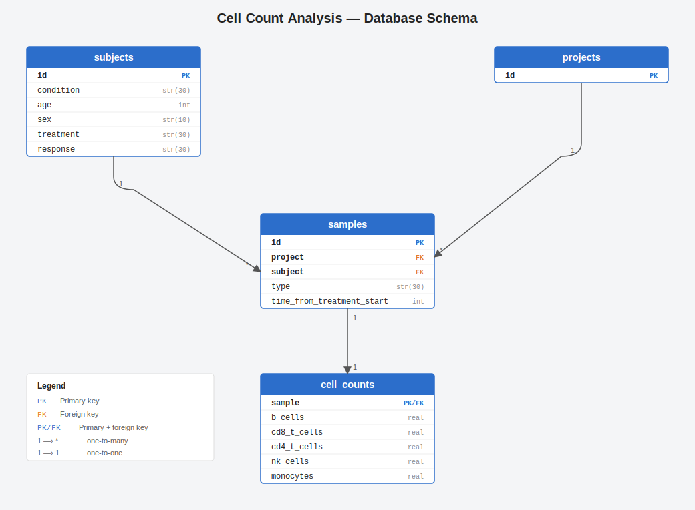

# drug-candidate-analysis
Data management and analysis for drug candidates on immune cell populations

## Setup
Run `make setup` to create a virtual environment with all dependencies to run this project  
Run `make pipeline` to call `load_data.py` to ingest `cell-count.csv` into the db  
Run `make dashboard` to start a local web server to view the interactive dashboard.
By default, this should be  http://127.0.0.1:5000.

## Architecture
The data backend uses SQLite, an embedded sql solution for lightweight use. 
The data layer was implemented to be datastore and data engine agnostic - different,
more scalable solutions could be plugged in my implementing the base classes.

The main database engine used is SQLAlchemy which provides a robust,
datastore agnostic interface around building and accessing SQL. It allows
declarative schema creation - simply see `data/schemas/cell_schema` to view how
tables are declared for this immune cell dataset. By using declarative schema creation,
no custom SQL dialects are needed to re-create the database in case the
dialect is ever swapped in favor of a better solution, like PostgresSQL.

## Data Model

Based on the immune cell dataset, I created 4 separate tables. I tried
to separate the data into logical partitions, and separated data from its metadata.

The subjects table contains metadata about the patient - condition, age, sex, treatment, response. 
I decided to put treatment and response in this table because based on the data I was given, it looks like
this information was tied to a subject rather than a sample.

The projects table is really more of a placeholder for project metadata.

The samples table contains metadata about the samples - project, subject, type, and time from treatment.

The cell_counts table is the main data for the project, which associates the cell counts with their sample.
I had considered making these separate tables as well, but decided to leave together for simpler query execution.
This would likely be an inefficiency with a massive amount of data if analysis is performed independently from the other subtypes.

## Front End
I used basic javascript and css to render the homepage. Given the dashboard
is simple and lightweight, I did not want to complicate the structure with progressive frameworks.

## API Server
I used flask because it is lightweight and simple to implement. I did
not expose any blanket API to query the database because it would be a major privacy violation and
unsafe. Whenever options are provided for filters in SQL queries, I make sure to use statements
with bindings to prevent SQL injection.

## Statistical Test
I created a simple abstraction over statistical test to eventually account
for the multitude of other tests available (like ANOVA / CHI, etc.).
I used two-sample t-test for my analysis because I wanted to test significance with
continuous data against a single binary category (cell count frequency vs drug response).
I also check variance equality (Levene's test) and fallback to Welch's t-test
when variances differ.

However, there is a known limitation with this t-test that the sample data is not
truly independent (there are multiple samples from the same subject)
